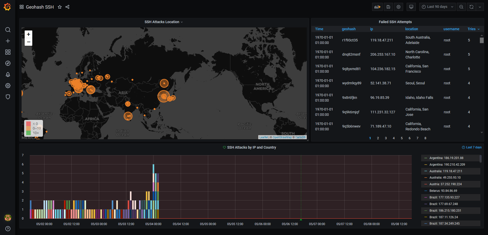

# Visualize bruteforce SSH attacker's location in real time


Thanks to Schkn for its original post https://devconnected.com/geolocating-ssh-hackers-in-real-time/

## Preview



[Grafana dashboard](https://grafana.com/grafana/dashboards/12323) id : __12323__

## Prerequisites

- An InfluxDB instance (or use docker-compose.standalone.yml)
- A Grafana instance (or use docker-compose.standalone.yml)
- Docker
- Rsyslog

## Rsyslog configuration

Add this under `/etc/rsyslog.conf` to forward ssh auth failures to local server :

```
template(name="OnlyMsg" type="string" string="%msg:::drop-last-lf%\n")
if $programname == 'sshd' then {
   if $msg startswith ' Failed' then {
      action(type="omfwd" target="127.0.0.1" port="7070" protocol="tcp" template="OnlyMsg")
   }
}
```

## Start the TCP server

### With a bundled InfluxDB and Grafana

`docker-compose -f docker-compose.standalone.yml up`

### As a Docker service (will restart on failure)

1. Change INFLUX_URL
2. Change INFLUX_DB
3. Change network if needed to access an Influx database within a Docker network

`docker-compose up -d`

## Test the TCP server

1. `docker-compose -f docker-compose.standalone.yml up`
2. `netcat localhost 7070`
3. type: `Failed password for username from 206.253.167.10 port 11111 ssh2`
4. Data should be parsed and added

## Optional configuration

* `INFLUX_PROTOCOL`: http or https, default is http. If you want to skip certificate
  validation, set `NODE_TLS_REJECT_UNAUTHORIZED` to 0, but don't do this without
  understanding the implications.
* `INFLUX_USER` and `INFLUX_PWD`: authentication for influx
* `DEBUG_LEVEL`: level of logging in log4js, default is "info".
